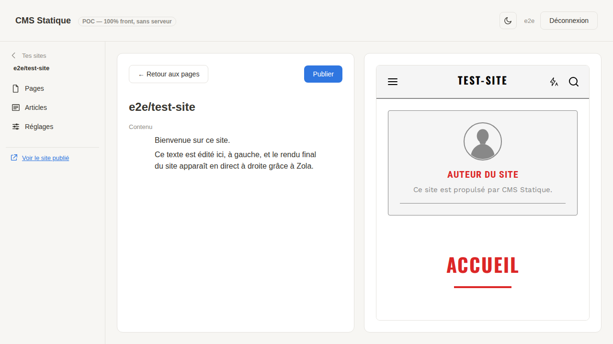

# Stamp CMS

## WordPress, sans le serveur.

Un CMS qui tourne **entièrement dans votre navigateur** — l'édition du contenu et la génération du site.

Gratuit à 100% et toujours :
- aucun serveur à héberger (et payer) comme pour Wordpress
- le site compilé est hébergé sur une plateforme gratuite comme Codeberg Pages.
- plus sécurisé, pas de mise à jour à faire !

**[Démo en ligne](https://botadrien.github.io/stamp-cms/)** — déployée automatiquement sur GitHub Pages à chaque push (voir `.github/workflows/deploy-pages.yml`).
> Note : la connexion sur cette démo suppose que `https://botadrien.github.io/stamp-cms/` soit déclarée comme Redirect URI de l'application OAuth2 correspondante sur codeberg.org (réglage manuel, une seule fois — voir `config.js`). **Dépôt renommé** (`cmstatic` → `stamp-cms`) : ce Redirect URI doit être mis à jour à la main sur codeberg.org, sinon la connexion sur la démo casse.



## Fonctionnalités

- **Connexion sans serveur** : OAuth2 + PKCE directement vers Codeberg ou GitLab (pas besoin de bridge), ou jeton d'accès personnel collé à la main pour GitHub (voir "Forges git" ci-dessous pour pourquoi GitHub n'a pas droit au même flow OAuth). Droits d'accès = rôles natifs du fournisseur choisi.
- **Multi-fournisseur** : Codeberg, GitHub et GitLab (gitlab.com uniquement, pas de self-hosted), via une couche d'abstraction commune (`api.js`/`github-api.js`/`gitlab-api.js`/`providers.js`) pensée pour qu'ajouter un fournisseur de plus n'exige pas de refonte.
- **Édition riche** : éditeur visuel similaire à Notion ([BlockNote.js](https://www.blocknote.js.org/) sur [ProseMirror](https://prosemirror.net/))
  Contenu stocké en Markdown, source de vérité dans le dépôt Git, commit direct à chaque enregistrement.
- **Génération du site** avec un renderer maison piloté par [Puck](https://puckeditor.com/) (`ssg-src/`), exécuté **dans le navigateur** à chaque publication — voir `docs/plan-puck-ssg.md` pour la conception complète (remplace l'ancien pipeline Zola/Tera).
- **Aperçu en direct** : pendant l'édition, un volet à côté de l'éditeur montre le site réellement généré (nav, mise en page) à partir du brouillon en cours — rien n'est publié tant qu'on n'a pas cliqué sur "Publier".
- **Publication en un clic** : chaque "Publier" compile le site et le publie sur la branche `pages` du dépôt.
- **Contenu structuré** : pages et articles de blog gérés séparément (triés par date pour le blog), écran "Réglages du site" pour le titre du blog.
- **Suppression d'un site** : depuis "Réglages du site", zone dangereuse qui supprime le dépôt entier chez le fournisseur (irréversible, il faut retaper le nom du dépôt pour confirmer).
- **Domaine personnalisé** : depuis "Réglages du site", sous-domaine uniquement pour l'instant (pas de domaine racine/apex) — instructions DNS et vérification en direct (CNAME, TXT le cas échéant) propres au fournisseur connecté, voir "Domaine personnalisé" plus bas pour le détail par fournisseur.
- **Mise en page visuelle** : écran dédié (onglet "Mise en page") qui ouvre l'éditeur [Puck](https://puckeditor.com/) — glisser-déposer des blocs (nav, hero, grille de fonctionnalités, cartes/extraits d'article, footer, etc.), réglage de leurs props, aperçu en direct avec les vraies données du site. Un gabarit par type de route (accueil, page, article, index du blog) ; tant qu'il n'a pas été personnalisé, un site retombe sur le gabarit par défaut (`ssg-src/default-templates.js`), partagé par tous les sites — voir "Éditeur de mise en page Puck" plus bas pour l'architecture.
- **Topic `stamp-cms`** : posé automatiquement sur chaque dépôt créé (topic Forgejo/GitHub/GitLab, public et cherchable). La liste "Tes sites" ne montre que les dépôts portant ce topic (les autres dépôts du compte n'y apparaissent pas), et les sites restent trouvables par recherche de topic côté fournisseur. Les dépôts créés avant l'ajout de cette fonctionnalité n'ont pas le topic et n'apparaissent donc plus dans la liste (pas de migration automatique, cohérent avec le stade très précoce du projet).

## Feuille de route

1. **Gestion des médias** (images, etc.) dans le dépôt Git.
2. **Système de plugins/thèmes**, avec une API d'extension stable pensée dès maintenant pour éviter un refactor douloureux plus tard, en vue d'une marketplace de plugins et de thèmes.
3. D'autres fournisseurs derrière la même couche d'abstraction — Codeberg, GitHub et GitLab y sont déjà branchés, voir "Forges git" plus bas.

## État de l'art / Inspirations

- **[Decap CMS](https://decapcms.org/) / [Tina CMS](https://tina.io/)** — CMS Git, mais orientés développeurs
- **[Sveltia CMS](https://github.com/sveltia/sveltia-cms)** — successeur spirituel de Decap, UI plus moderne, config toujours technique
- **[Publii](https://getpublii.com/)** — facile à utiliser sans être développeur·euse. L'app desktop à installer rend la collaboration compliquée.
- **[GitCMS](https://github.com/BestPlayerMMIII/GitCMS)** (open source, éditeur TipTap) et **[gitcms.dev](https://gitcms.dev/)** (service commercial, mais passe par une GitHub App donc nécessite un backend — hors scope ici)
- **[VvvebJs](https://github.com/givanz/VvvebJs)** — édition en place sur le DOM réel, sans preview séparée, vanilla JS sans build tool. Pas réutilisable tel quel (pages HTML statiques, pas de séparation contenu/template, couplé à Bootstrap), mais bonne référence d'architecture pour une édition inline sans framework lourd.

## Développement / Contribuer

### Lancer en local

1. Créer une OAuth App sur Codeberg (**Settings → Applications**), en **décochant "Confidential Client"** , avec comme Redirect URI `http://localhost:8080`
2. Coller le `clientId` généré dans `config.js`
3. `npm install`
4. `make run`
5. Ouvrir `http://localhost:8080/`

Pour se connecter avec GitHub à la place, rien à configurer : générer un jeton d'accès
personnel classique avec les scopes `repo` et `delete_repo` (`delete_repo` requis pour
supprimer un site depuis les réglages — le POC propose un lien direct vers l'écran de
création du jeton, scopes pré-remplis) et le coller sur l'écran de connexion.

Pour se connecter avec GitLab (gitlab.com uniquement) : créer une application sur
[gitlab.com/-/user_settings/applications](https://gitlab.com/-/user_settings/applications)
avec comme Redirect URI `http://localhost:8080`, scope `api` uniquement, et **décocher
"Confidential"** pour forcer PKCE (pas de secret nécessaire). Coller l'"Application ID"
généré dans `gitlabClientId` dans `config.js`.

### Lancer les tests

Plutôt que de mocker les appels API, les tests e2e (`e2e/`) font tourner une vraie instance [Forgejo](https://forgejo.org/) en local via Docker et pilotent un vrai navigateur (Playwright) à travers le flow complet : login OAuth2+PKCE réel (formulaire de connexion, écran de consentement), édition et commit d'un fichier — vérifié ensuite via l'API Forgejo elle-même.

```bash
npm install
npm run e2e        # up (Forgejo + seed) + tests + down, tout en un
```

Ou étape par étape (utile pour déboguer) :

```bash
npm run e2e:up     # démarre Forgejo, crée un user/app OAuth2/dépôt de test (e2e/seed.mjs)
npm run e2e:test   # lance les tests Playwright (démarre aussi le serveur statique du POC)
npm run e2e:down   # arrête et nettoie
```

Suite e2e GitLab séparée (`npm run e2e:gitlab`) — même principe (vraie instance `gitlab/gitlab-ce`
en Docker, pas de mock), mais **pas incluse dans `npm run e2e` ni dans la CI par défaut** :
l'image GitLab CE est nettement plus lourde/lente à démarrer (plusieurs minutes, contre
~1 min pour Forgejo). À lancer manuellement pour tester le chemin GitLab.


## Points à trancher / vigilance

- Conflits d'édition simultanée (verrouillage simple vs temps réel type [Yjs](https://yjs.dev/))
- Sécurité du token OAuth stocké côté navigateur
- Quotas de l'API du fournisseur Git
- Domaine personnalisé : traité pour les sous-domaines (voir "Domaine personnalisé" plus bas) — les domaines racine/apex restent un point ouvert (mécanisme A/AAAA/ALIAS différent par fournisseur, pas encore supporté)
- Médias dans le dépôt Git : ça marche, mais avec des limites de taille (repos volumineux, fichiers individuels plafonnés) — à surveiller si beaucoup de photos/vidéos
- Rester multi-fournisseur à terme sans complexifier le MVP
- Palette de composants Puck encore minimale (hero, grille, CTA, carte/extrait d'article, nav, footer, corps de page) — pas de composant image, par exemple
- Un seul gabarit par type de route (accueil/page/article/index du blog) : pas de gabarit dédié à UNE page en particulier (ex. une page d'accueil visuellement différente d'une autre page standalone), voir "Éditeur de mise en page Puck" plus bas

## Pistes explorées et mises de côté

### vrai client git en frontend

Une tentative de remplacer l'API REST "contents" de Forgejo par du vrai git (clone/fetch/push en mémoire dans le navigateur, via [isomorphic-git](https://isomorphic-git.org/) + [lightning-fs](https://github.com/isomorphic-git/lightning-fs)) a été menée pour de bon — un seul push au lieu de N requêtes GET/PUT par fichier, et une vraie détection de conflit par fast-forward côté serveur plutôt que le verrou par sha de Forgejo.
Le code fonctionne et est vérifié par la suite e2e complète (voir la branche [`explore/isomorphic-git`](https://github.com/botadrien/stamp-cms/tree/explore/isomorphic-git)), mais n'a pas été mergé sur `main` : Codeberg ne renvoie pas d'en-tête CORS sur ses endpoints git smart-HTTP (contrairement à `/api/v1/*`), ce qui oblige à passer par un proxy CORS pour cloner/pousser depuis le navigateur.
Le seul proxy public gratuit (`cors.isomorphic-git.org`) s'est montré trop instable en pratique (erreurs Cloudflare 403/502 constatées aussi bien depuis un environnement de test que depuis une IP résidentielle normale) pour être utilisable en prod telle quelle.
À revisiter si un proxy auto-hébergé devient acceptable, ou si Codeberg ajoute un jour le support CORS sur ces routes.

### Compiler le site dans des actions CI plutôt qu’en frontend

C’est l'architecture "normale" pour un générateur de site statiques : compiler le site dans les GitHub Actions ou Codeberg/Forgejo Actions.
- Avantage : plus simple à mettre en place (pas besoin de compiler en wasm le cli de SSG)
- Avantage : plus rapide que le navigateur
- Avantage : scale probablement mieux
- Inconvénient : on a envie de permettre des prévisualisations live, il faut donc faire tourner le SSG dans le navigateur
- Inconvénient : sur Codeberg les actions ne sont pas automatiquement ouvertes à toustes
- Inconvénient : on veut être autant indépendant que possible de systèmes externes

### [Hugo](https://gohugo.io/) plutôt que Zola

écarté après un vrai essai : Hugo compile en WASM mais son pipeline d'assets (Sass) dépend de `os/exec` pour appeler un binaire Dart Sass externe, ce qu'un bac à sable WebAssembly ne permet pas (aucun lancement de process).

### Réutiliser l'éditeur Gutenberg de WordPress

Idée : reprendre `@wordpress/block-editor` (npm, utilisable hors WordPress via des projets comme [isolated-block-editor](https://github.com/Automattic/isolated-block-editor)) plutôt que redévelopper un éditeur par blocs.
Écarté : licence GPLv2+ (copyleft fort, tension avec une marketplace de plugins/thèmes payants), couplage à une API REST WordPress à démonter, format de sérialisation en HTML à commentaires plutôt que Markdown (contredit "contenu stocké en Markdown" ci-dessus), dépendances plus lourdes que BlockNote.
Et surtout : ça n'évite pas le vrai travail (mapper chaque bloc vers une macro Tera pour le rendu publié) — le rendu WordPress passe par PHP, inutilisable tel quel avec Zola.

## Détails techniques

### Forges git

Codeberg répond aux requêtes cross-origin (CORS) sur `/login/oauth/access_token` et sur `/api/v1/*` avec les en-têtes `Access-Control-Allow-Origin`.
Mais Forgejo vanilla ne le fait pas nativement sur ces routes.
`e2e/Caddyfile` reproduit ce comportement via un reverse proxy devant Forgejo, pour que l'environnement de test colle au vrai comportement de production.

**Pourquoi GitHub n'a pas le même flow OAuth2 + PKCE que Codeberg** : `api.github.com` répond bien en CORS pour tous les appels REST une fois authentifié, mais `github.com/login/oauth/access_token` (l'échange code → token) ne renvoie aucun en-tête CORS, ce qui bloque l'appel depuis un navigateur.
Pire, même avec le support PKCE ajouté par GitHub en 2025, GitHub exige toujours un `client_secret` pour cet échange — un secret qu'on ne peut pas committer dans une appli 100% front sans le rendre public à toustes.
Plutôt qu'un serveur/proxy dédié rien que pour cet échange (qui aurait été le premier serveur requis par ce projet, contraire à son principe fondateur), GitHub se connecte via un jeton d'accès personnel collé à la main — voir `github-api.js`, `providers.js` et `auth.js:loginWithToken`.

**GitLab** (gitlab.com uniquement, pas de self-hosted) a bien droit au flow OAuth2 + PKCE en un clic comme Codeberg : `gitlab.com/oauth/token` renvoie `access-control-allow-origin: *` (vérifié en direct, preflight et réponse réelle), pas de blocage CORS comme sur GitHub.
En revanche GitLab Pages n'a pas d'équivalent du webhook Codeberg ou de l'API Pages GitHub : son API Pages (`GET`/`PATCH`/`DELETE /projects/:id/pages`) ne gère que les réglages (domaine, HTTPS) et la dépublication, aucun endpoint d'upload direct — **un pipeline CI est toujours requis pour publier**, contrairement aux deux autres fournisseurs.
`GitLabApi.enablePublishing()` (`gitlab-api.js`) committe donc une fois un `.gitlab-ci.yml` minimal dont le job ne compile rien : il republie tel quel (via `rsync`) le contenu déjà buildé côté client et présent sur la branche `pages`, pour rester cohérent avec le principe du projet (compilation toujours dans le navigateur, jamais côté serveur/CI).

La couche d'abstraction (`ForgejoApi` dans `api.js`, `GitHubApi` dans `github-api.js`, `GitLabApi` dans `gitlab-api.js`, choix du bon client via `providers.js`) absorbe les différences d'API entre les trois forges : création de branche (un seul appel côté Forgejo/GitLab, lecture de ref + création de ref côté GitHub), activation de la publication (webhook côté Codeberg Pages, appel dédié à l'API Pages côté GitHub, `.gitlab-ci.yml` committé côté GitLab), `PUT` systématique de l'API contents de GitHub là où Forgejo/GitLab distinguent `POST`/`PUT` selon création ou mise à jour, et la détection de conflit d'édition (422 chez Forgejo, 409 chez GitHub, 400 chez GitLab — voir `isConflict()` sur chaque client).
GitLab identifie aussi ses projets par un chemin `owner/repo` URL-encodé en un seul segment d'URL plutôt que deux segments séparés, et pagine son endpoint d'arbre de fichiers (`listTree()`) là où Forgejo/GitHub renvoient tout en un seul appel — détails absorbés par `gitlab-api.js`, voir ses commentaires de tête de fichier.

### Génération du site dans le navigateur

Le site est rendu par un renderer maison piloté par [Puck](https://puckeditor.com/)
(`ssg-src/`, voir `docs/plan-puck-ssg.md` pour la conception complète), en JS pur —
pas de binaire WASM, pas de shim WASI. `ssg-src/content-loader.js` parse
`content/*.md` (front matter TOML + Markdown -> HTML via `remark`), `ssg-src/context.js`
construit le contexte de données, `ssg-src/resolver.js` résout les bindings des gabarits
Puck, et `ssg-src/renderer.jsx` orchestre le tout : parcourt les routes du site, rend
chaque page via `<Render>` de Puck + `renderToStaticMarkup`, génère `rss.xml`/`sitemap.xml`.
Bundlé pour le navigateur via `editor-src/ssg-builder.js` -> `ssg-builder.bundle.js`
(global `SsgBuilder`), même principe que `editor.jsx`/`RichEditor`.

Un site retombe sur le gabarit par défaut (`ssg-src/default-templates.js`) tant qu'il
n'a pas été personnalisé via l'éditeur de mise en page (voir section dédiée ci-dessous).

Lors de la publication, chaque fichier produit (HTML, `rss.xml`, `sitemap.xml`) est
publié sur la branche `pages`.

### Éditeur de mise en page Puck

Écran "Mise en page" (sidebar) : liste les 4 types de gabarit (accueil, page standalone,
article de blog, index du blog — mêmes clés que `ssg-src/default-templates.js`), ouvre
l'éditeur visuel `<Puck>` (`@puckeditor/core`) en plein écran sur celui choisi
(`openLayoutEditor()` dans `app.js`).

**Stockage** : un fichier `templates/<nom>.puck.json` par gabarit personnalisé, sur la
branche `main` (`LAYOUT_TEMPLATE_FILES` dans `site-builder.js`) — le JSON brut produit
par Puck (`{ root, content }`, voir `ssg-src/renderer.jsx`). Absent -> le gabarit par
défaut correspondant s'applique, fusion fichier par fichier comme l'ancien thème Zola
avant lui (un site n'ayant personnalisé qu'UN SEUL gabarit garde les trois autres par
défaut). Le bouton "Publish" natif de Puck écrit ce fichier puis republie tout le site
(`saveLayoutTemplate()` dans `site-builder.js`) — pas de brouillon local à gérer comme
pour l'éditeur de contenu : le canvas de Puck EST déjà l'aperçu en direct.

**Aperçu avec les vraies données** : le canvas affiche les composants avec de vrais
bindings résolus (nav du site, dernier article, etc.), pas des données inventées —
`buildLayoutEditorData()` (`site-builder.js`) construit un Context de prévisualisation
(`SsgBuilder.buildContext()`/`loadCollections()`) à partir du contenu réel du site, avec
la première page/le premier article existant comme représentant·e pour les gabarits
"page"/"article".

**Contrainte cross-bundle React** : `editor-src/puck-layout-editor.jsx` (bundlé à part,
`puck-layout-editor.bundle.js`, global `PuckLayoutEditor`) réimporte la palette de
composants (`ssg-src/registry.jsx`) au lieu de réutiliser `SsgBuilder`'s — chaque bundle
esbuild IIFE embarque sa propre copie de React (voir "Inclusion des packages JS"
ci-dessous), et les fonctions `render()` de la palette (qui appellent `useContext`, voir
`ssg-src/ssg-context.js`) doivent tourner sous LE MÊME React que celui qui pilote
`<Puck>` — sinon erreur "Invalid hook call", ou pire, un `Context.Provider` dont la
valeur ne traverse jamais jusqu'au composant. Seules des données pures (le `Context`
lui-même) traversent la frontière entre bundles sans risque. Pour la même raison, le
canvas d'édition est rendu avec `iframe: { enabled: false }` (rendu inline dans le
document plutôt que dans un iframe isolé, qui serait un realm JS séparé où le
`SsgContext.Provider` posé autour de `<Puck>` ne serait jamais vu).

### Lecture du dépôt : archive complète + cache local

`content/` (pages, articles) est lu en un seul aller-retour réseau par fournisseur
plutôt qu'un appel par fichier :
- **Forgejo/Codeberg et GitLab** : un appel à l'endpoint d'archive (`/archive/{ref}.tar.gz`, `/repository/archive.tar.gz`), CORS ouvert vérifié en direct sur les deux (`access-control-allow-origin: *`), décompressé et parsé côté navigateur (`DecompressionStream` natif + petit parseur tar maison dans `tar-utils.js`, pas de dépendance zip).
- **GitHub** : l'archive/tarball est bloquée pour un usage navigateur (`/tarball/{ref}` redirige vers `codeload.github.com`, qui ne renvoie `access-control-allow-origin` que pour `render.githubusercontent.com`, vérifié en direct). À la place : un `listTree` (déjà un seul appel) puis **une seule** requête GraphQL groupée (`api.github.com/graphql`, CORS ouvert vérifié) avec un alias par fichier.
- Piège rencontré (et corrigé) sur l'endpoint archive Forgejo : il répond `Cache-Control: private, max-age=300` sur une URL qui ne varie pas avec le commit (`.../archive/main.tar.gz`) — sans `cache: "no-store"` explicite sur le `fetch`, le cache HTTP du navigateur pouvait reservir une archive périmée après deux publications rapprochées (repéré via la suite e2e, page fraîchement publiée absente de la liste juste après).

Le résultat (`{ chemin: Uint8Array }` pour tout le dépôt) est mis en cache localement en **IndexedDB** (`repo-cache.js`) plutôt que retéléchargé à chaque écran : un sha HEAD de branche (appel léger, un par fournisseur) est comparé au sha mis en cache avant de décider de retélécharger ou non — `localStorage` a été écarté (quota ~5-10 Mo/origine, API synchrone bloquante, chaînes de caractères seulement).

### Domaine personnalisé

Réglage stocké dans un nouveau fichier **`site.toml`** à la racine de chaque dépôt de site (branche `main`) — première brique du futur "fichier structuré de config du site" évoqué dans "Architecture cœur/thèmes/plugins" plus bas. Jamais lu par le renderer (ni `content/`, ni le reste du dépôt), donc jamais publié sur la branche `pages` : reste un fichier source, comme `content/*.md`. Lu/écrit via `getCustomDomain()`/`setCustomDomain()` (`site-builder.js`), et propagé dans le `baseUrl` passé au renderer à chaque publication (`rebuildAndPublishSite()`).

**Sous-domaines uniquement** (ex. `www.exemple.com`) — pas de domaine racine/apex, pour éviter la variété de mécanismes A/AAAA/ALIAS/ANAME selon le registrar. Chaque fournisseur a un mécanisme d'activation différent (vérifié contre leurs docs officielles) :
- **GitHub Pages** : un simple champ `cname` sur l'API Pages (`PUT /repos/{owner}/{repo}/pages`) — pas de fichier `CNAME` à committer.
- **Codeberg Pages** : purement basé sur le DNS (CNAME + un enregistrement TXT d'autorisation à `_git-pages-repository.<domaine>`) — mais le webhook de publication existant (voir `ForgejoApi.enablePublishing`) doit être repointé vers le nouveau domaine, sans quoi la publication cible encore l'ancienne URL. Ce repointage casse la publication tant que le DNS n'a pas propagé — l'écran Réglages en avertit explicitement.
- **GitLab Pages** : API dédiée (`/projects/:id/pages/domains`), avec une étape de vérification DNS (enregistrement TXT `gitlab-pages-verification-code=...`) obligatoire sur gitlab.com avant que le domaine ne serve réellement le site (`auto_ssl_enabled` pour un certificat Let's Encrypt automatique).

**Vérification DNS en direct** (`dns-check.js`) : un vrai lookup DNS n'est pas possible depuis un navigateur, donc interrogation de l'API DNS-over-HTTPS de Cloudflare (`cloudflare-dns.com/dns-query`, CORS ouvert vérifié en direct) pour savoir si le CNAME pointe déjà vers la bonne cible — utilisé pour le bouton "Vérifier le DNS" et comme garde-fou avant de repointer le webhook Codeberg (avertissement si le DNS ne semble pas encore configuré, plutôt que de casser la publication à l'aveugle).

### Aperçu en direct

Pendant l'édition d'une page, un rebuild tourne en arrière-plan (débounce ~1,8s après la dernière frappe) sur le dépôt déjà publié + le brouillon en cours, non enregistré (`buildPreviewSite()` dans `site-builder.js`).
Sa sortie (un site multi-pages avec de vrais liens relatifs entre pages) est servie par un **service worker** (`sw.js`) qui intercepte les requêtes sous `/preview/<owner>/<repo>/...` et répond directement depuis une map en mémoire — pas de blob URL ni de `srcdoc` d'iframe, qui casseraient la navigation entre pages.
Le renderer reçoit un `baseUrl` différent pour ce build (`/preview/...` plutôt que l'URL réelle du site publié), sinon les liens de nav seraient générés en absolu vers un domaine de prod qui n'a pas encore ce contenu.
Rien n'est publié sur le fournisseur tant qu'on ne clique pas sur "Publier" — l'aperçu ne touche que la mémoire du navigateur.

### Inclusion des packages JS

BlockNote (React + ProseMirror + Mantine) est trop imbriqué pour un `<script>`/CDN sans bundler (duplication de singletons ProseMirror).
`ssg-src/renderer.jsx` (React + Puck) et l'éditeur de mise en page (`editor-src/puck-layout-editor.jsx`, React + `<Puck>`) ont besoin du même traitement.
`npm run build` (esbuild) produit trois bundles IIFE : `editor.bundle.js`/`.css`, `ssg-builder.bundle.js` et `puck-layout-editor.bundle.js`/`.css` — le second reçoit un `Buffer` global injecté (`--inject:editor-src/buffer-shim.js`, package `buffer`) car `gray-matter` y fait référence sans condition, un global Node absent des navigateurs. Les trois bundles embarquent chacun leur propre copie de React (aucun module partagé entre bundles esbuild IIFE séparés) — voir "Éditeur de mise en page Puck" plus haut pour pourquoi ça impose de réimporter la palette de composants dans `puck-layout-editor.bundle.js` plutôt que de la réutiliser depuis `ssg-builder.bundle.js`.
Il génère ensuite `index.html` depuis `index.template.html` (le fichier à éditer, `index.html` est gitignore).
Chaque script/style local reçoit un `?v=<hash du commit>`, pour éviter le cache périmé après déploiement.
Le reste de l'app : scripts classiques, sans build.

### Architecture cœur/thèmes/plugins (à venir)

Pour le futur système de plugins/thèmes (feuille de route, item 2), approche **hybride** retenue plutôt qu'un vrai split en deux outils.
Le cœur (`app.js`, `api.js`, éditeur, renderer) reste hébergé centralement sur stamperia.io, mis à jour pour tous les sites d'un coup.
La partie thème de ce pattern reste à construire côté Puck : le mécanisme précédent ("chaque dépôt de site a sa propre copie du thème") a été retiré avec Zola — tous les sites partagent aujourd'hui le même jeu de gabarits par défaut (`ssg-src/default-templates.js`, voir "Génération du site dans le navigateur" plus haut), sans notion de thème/plugin par site pour l'instant.

Pourquoi l'approche hybride : updates cœur centralisées (vs vrai split où chaque site fige sa version à la création), repos de site plus légers, une seule surface de sécurité à auditer.
Migrer plus tard vers un vrai split ("eject" = copier le cœur dans le repo une fois) resterait facile depuis l'hybride ; l'inverse serait coûteux une fois des sites divergés — d'où ce point de départ, à condition de traiter l'API cœur/plugin comme un contrat stable dès le début.

Config du site (thème choisi, réglages plugins) : fichier structuré (JSON/TOML) dans le repo, pas SQLite — reste diff-friendly (front matter + gabarits Puck en JSON), évite les conflits de merge sur binaire que SQLite documente lui-même comme un mauvais fit pour git.

