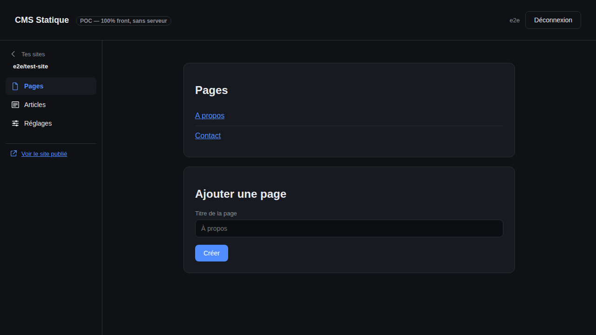

# CMS Statique

## WordPress, sans le serveur.

Un CMS qui tourne **entièrement dans votre navigateur** — l'édition du contenu comme la génération du site — sans serveur à héberger, sans base de données à sécuriser, sans rien savoir de Git.
Le site produit est hébergé et publié directement sur [Codeberg](https://codeberg.org/).

Inspiré de [Decap CMS](https://decapcms.org/) et [Tina CMS](https://tina.io/), mais pensé pour des personnes **non techniques qui ne savent pas ce qu'est Git** — là où Decap et Tina restent conçus par et pour des développeurs, et laissent transparaître la mécanique Git (branches, commits...).



Projet réel, pas juste une spec : tout ce qui est listé ci-dessous fonctionne (voir "Tester en local").
Mais très tôt dans sa vie — pas de version publiée, pas de garantie de stabilité, ruptures attendues.
Voir "Roadmap" pour la suite et "Points à trancher / vigilance" pour ce qui reste ouvert.

## Fonctionnalités

- **Connexion sans serveur** : OAuth2 + PKCE directement vers Codeberg (pas besoin de bridge). Droits d'accès = rôles natifs de Codeberg.
- **Édition riche** : éditeur visuel similaire à Notion ([BlockNote.js](https://www.blocknote.js.org/) sur [ProseMirror](https://prosemirror.net/)
  Contenu stocké en Markdown, source de vérité dans le dépôt Git, commit direct à chaque enregistrement.
- **Génération du site** avec [Zola](https://www.getzola.org/), compilé en WebAssembly et exécuté **dans le navigateur** à chaque publication.
- **Publication en un clic** : chaque "Publier" compile le site et le publie sur la branche `pages` du dépôt.
- **Contenu structuré** : pages et articles de blog gérés séparément (triés par date pour le blog), écran "Réglages du site" pour le titre du blog.
- **Thème** : un thème vendoré, volks-typo, appliqué à chaque site créé (choix de thème prévu plus tard, voir "Roadmap").

## Roadmap


1. **Gestion des médias** (images, etc.) dans le dépôt Git.
2. **Support multi-fournisseur Git** (GitLab, GitHub...) via une couche d'abstraction commune.
3. **Système de plugins/thèmes**, avec une API d'extension stable pensée dès maintenant pour éviter un refactor douloureux plus tard, en vue d'une marketplace de plugins et de thèmes.

## Tester en local

Le POC (`index.template.html`, `config.js`, `pkce.js`, `auth.js`, `api.js`, `app.js`, `site-builder.js`) couvre le login OAuth+PKCE, la liste des dépôts, et la lecture/écriture d'un fichier Markdown via commit direct, avec un éditeur riche (BlockNote.js, voir `editor-src/editor.jsx`) plutôt que du Markdown brut.

BlockNote (React + ProseMirror + Mantine) est trop imbriqué pour être chargé fiablement via des `<script>`/CDN sans bundler (duplication de singletons ProseMirror entre le point d'entrée principal et ses sous-modules) — un petit build esbuild (`npm run build`) produit `editor.bundle.js`/`.css`.
Ce même build génère aussi `index.html` à partir de `index.template.html` (le fichier à éditer — `index.html` est généré, gitignore) en ajoutant un `?v=<hash du commit>` à chaque script/style local, pour que les navigateurs (ou un CDN devant Codeberg Pages) rechargent bien les fichiers après un déploiement au lieu de resservir une version périmée en cache.
Le reste de l'app reste des scripts classiques sans build.

### Génération du site (Zola en WebAssembly)

À la création d'un site et à chaque "Publier", tout le site (config + templates fixes + tout le Markdown sous `content/`) est **rebuildé avec [Zola](https://www.getzola.org/) réellement compilé en WebAssembly**, exécuté en mémoire dans le navigateur (aucun fichier réel touché, aucun serveur), puis chaque fichier HTML produit est publié sur la branche `pages`.
C'est un vrai générateur de site statique — mise en page partagée, navigation entre pages générée automatiquement par les fonctions Tera de Zola (`section.pages`, `get_section`), résolution des liens internes — pas un export page par page fait main.

Deux pistes explorées et écartées avant ça, pour référence :
- **Pipeline CI (Codeberg/Forgejo Actions + Eleventy)** — l'architecture "normale" pour un générateur de site.
  Écartée : Forgejo Actions est désactivé par défaut par dépôt (activation manuelle dans Settings > Units), et l'alternative Woodpecker CI de Codeberg nécessite de remplir un formulaire et d'attendre la validation manuelle d'un·e bénévole — incompatible avec "aucune configuration technique pour l'utilisateur·rice".
- **Hugo compilé en WebAssembly** — écarté après un vrai essai : Hugo compile mais son pipeline d'assets (Sass) dépend de `os/exec` pour appeler un binaire Dart Sass externe, ce qu'un bac à sable WebAssembly ne permet pas (aucun lancement de process).

Zola a fonctionné parce que son build (`getzola/zola`, patché sur la branche `wasm` d'un fork, voir [ce billet](https://dstaley.com/posts/running-zola-on-wasm/)) ne dépend d'aucun process externe : rayon (parallélisme) désactivé, `canonicalize()` contourné (non supporté par WASI), et Sass compilé par `grass` (Rust pur) plutôt que par LibSass/Dart Sass.
Le binaire (`vendor/zola.wasm`, ~15 Mo, commité tel quel car sa compilation demande un toolchain Rust + wasi-sdk trop lourd pour `npm run build` — voir `scripts/build-zola-wasm.sh` pour le reconstruire) tourne dans le navigateur via [`@bjorn3/browser_wasi_shim`](https://github.com/bjorn3/browser_wasi_shim), avec un système de fichiers entièrement en mémoire (voir `editor-src/zola-builder.js`).

Chaque site est buildé avec le même thème Zola vendoré, **volks-typo** (`themes/volks-typo/`, récupéré via `scripts/fetch-theme-volks-typo.sh` — voir `site-builder.js` pour le point d'accroche prévu pour un choix de thème plus tard).
Le contenu `content/*.md` est réparti en deux types selon son chemin : les pages standalone (`content/`) et les articles de blog (`content/blog/`, triés par date, flux RSS/Atom générés).
L'écran "pages du site" liste les deux séparément, avec un formulaire "Ajouter" propre à chacun ; un écran "Réglages du site" permet d'éditer le titre du blog (seul réglage éditable pour l'instant, stocké dans le front matter de `content/_index.md`).

1. Crée une OAuth App sur Codeberg (**Settings → Applications**), en **décochant "Confidential Client"** (client public, sans secret, requis pour PKCE), avec un Redirect URI qui correspond exactement à l'URL de déploiement (ex. `http://localhost:8080/` en local).
2. Colle le `clientId` généré dans `config.js`.
3. Installe les dépendances et sers le dossier (obligatoire — `file://` casse `fetch` et `crypto.subtle`, et OAuth n'accepte pas les chemins locaux comme Redirect URI) :
   ```bash
   npm install
   make run
   ```
4. Va sur `http://localhost:8080/`, connecte-toi, ouvre un dépôt, édite/crée un fichier `.md` et enregistre — ça doit produire un vrai commit sur Codeberg.

## Tests e2e (Forgejo local)

Plutôt que de mocker les appels API, les tests e2e (`e2e/`) font tourner une vraie instance [Forgejo](https://forgejo.org/) en local via Docker et pilotent un vrai navigateur (Playwright) à travers le flow complet : login OAuth2+PKCE réel (formulaire de connexion, écran de consentement), édition et commit d'un fichier — vérifié ensuite via l'API Forgejo elle-même.

```bash
npm install
npm run e2e        # up (Forgejo + seed) + tests + down, tout en un
```

Ou étape par étape (utile pour déboguer) :

```bash
npm run e2e:up     # démarre Forgejo, crée un user/app OAuth2/dépôt de test (e2e/seed.mjs)
npm run e2e:test   # lance les tests Playwright (démarre aussi le serveur statique du POC)
npm run e2e:down   # arrête et nettoie
```

Point notable découvert en construisant ces tests : Codeberg répond aux requêtes cross-origin (CORS) sur `/login/oauth/access_token` et sur `/api/v1/*` avec les en-têtes `Access-Control-Allow-Origin` — sans quoi le POC casserait en `Failed to fetch` — mais Forgejo vanilla ne le fait pas nativement sur ces routes.
`e2e/Caddyfile` reproduit ce comportement via un reverse proxy devant Forgejo, pour que l'environnement de test colle au vrai comportement de production.

## Points à trancher / vigilance

- Conflits d'édition simultanée (verrouillage simple vs temps réel type Yjs)
- Sécurité du token OAuth stocké côté navigateur
- Quotas de l'API du fournisseur Git
- Prévisualisation avant publication
- Domaine personnalisé
- Médias dans le dépôt Git : ça marche, mais avec des limites de taille (repos volumineux, fichiers individuels plafonnés) — à surveiller si beaucoup de photos/vidéos
- Rester multi-fournisseur à terme sans complexifier le MVP

## Piste explorée puis abandonnée : isomorphic-git

Une tentative de remplacer l'API REST "contents" de Forgejo par du vrai git (clone/fetch/push en mémoire dans le navigateur, via isomorphic-git + lightning-fs) a été menée pour de bon — un seul push au lieu de N requêtes GET/PUT par fichier, et une vraie détection de conflit par fast-forward côté serveur plutôt que le verrou par sha de Forgejo.
Le code fonctionne et est vérifié par la suite e2e complète (voir la branche [`explore/isomorphic-git`](https://github.com/botadrien/cmstatic/tree/explore/isomorphic-git)), mais n'a pas été mergé sur `main` : Codeberg ne renvoie pas d'en-tête CORS sur ses endpoints git smart-HTTP (contrairement à `/api/v1/*`), ce qui oblige à passer par un proxy CORS pour cloner/pousser depuis le navigateur.
Le seul proxy public gratuit (`cors.isomorphic-git.org`) s'est montré trop instable en pratique (erreurs Cloudflare 403/502 constatées aussi bien depuis un environnement de test que depuis une IP résidentielle normale) pour être utilisable en prod telle quelle.
À revisiter si un proxy auto-hébergé devient acceptable, ou si Codeberg ajoute un jour le support CORS sur ces routes.

## État de l'art

- **Decap CMS / Tina CMS** — CMS Git, mais orientés développeurs
- **Sveltia CMS** — successeur spirituel de Decap, UI plus moderne, config toujours technique
- **Publii** — non-dev-friendly mais app desktop à installer, pas 100% web
- **GitCMS** (open source, éditeur TipTap) et **gitcms.dev** (service commercial, mais passe par une GitHub App donc nécessite un backend — hors scope ici)
